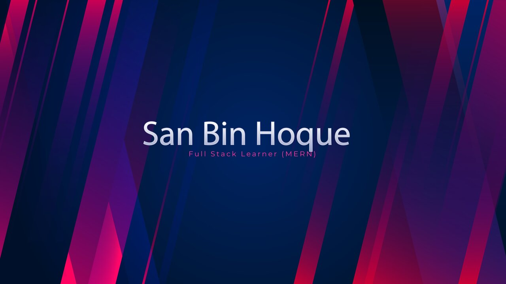

# I am "San Bin Hoque", Hey
I am a Student at Computer Science. My Passion In Web 2.

### 🤵🏻‍♂️About Me
Hello! I'm San Bin Hoque, a front-end and back-end learner.I'm proficient in using JavaScript, React, and other front-end technologies to create front-end projects. I'm currently  Working In back-end development. I have worked on creating many static and dynamic web pages. Such as Portfolio, E-Commerce, ChatBot, Messaging app, Landing Page Etc.

### 📘Education
I'm a student at Computer Science and Engineering in Feni Polytechnic Institute. My Graduation is going on there.

- Diploma (Running)

### 💻Skills In     
- HTML_5
- CSS_3
- Javascript_ES6
- React JS
- Bootstrap
- Tailwind CSS
- SASS
- Node JS
- Express JS
- Mongo DB
  
### 🗣️Communication Languages
- English (Intermediate)
- Bangla (Advance)
- Hindi (Communicative)
  

Thanks For Consideration        

